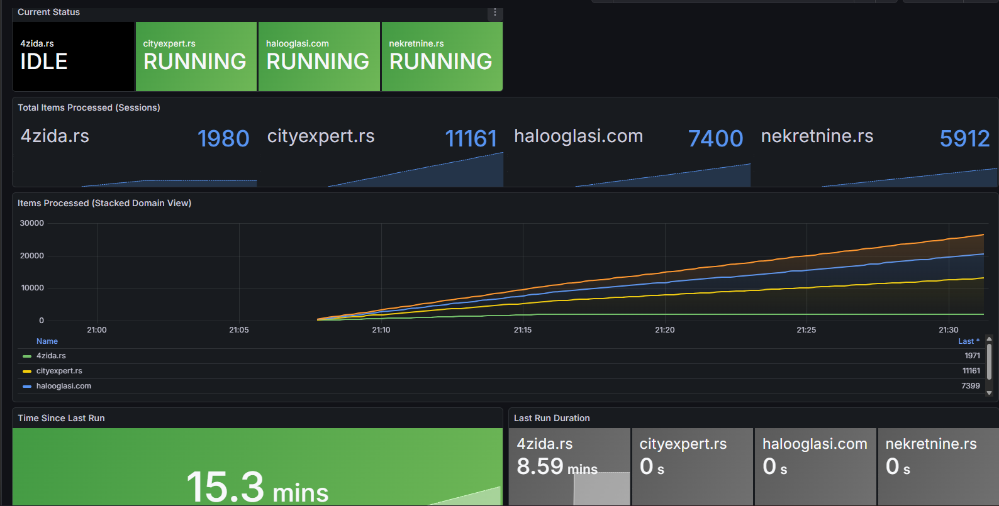

# BelgradeEstateML Parser

High-performance real estate scraper for the Belgrade market, built with Go and Colly.

## 🚀 Overview

This service automatically scrapes real estate listings from major Serbian websites, parses details (price, area, location, floors), and stores them in a PostgreSQL database for further analysis and ML modeling.

### Supported Sites
- **4zida.rs** (Fixed 99 pages)
- **halooglasi.com** (Dynamic pagination)
- **nekretnine.rs** (Dynamic pagination)
- **cityexpert.rs** (Dynamic pagination)

## 🛠 Features

- **Parallel Processing**: Each site is parsed in its own goroutine for maximum speed.
- **Auto-Rotation**: Scrapers run every 48 hours automatically.
- **Smart Storage**: Uses `ON CONFLICT` to update existing listings instead of duplicating.
- **Monitoring**: Built-in Prometheus metrics export.
- **Logging**: Rotating logs with 40MB limit to prevent storage exhaustion.

## 🚀 Deployment

### Prerequisites
- Docker & Docker Compose
- `.env` file in the `parser/` directory

### Local Start
```bash
docker-compose up -d
```

### 🛰 Server Deployment (Remote)

To deploy on a remote server, you need to pull the image from GitHub Container Registry (GHCR). Even for public packages, it's recommended to log in to avoid rate limits or permission issues.

1. **Create a GitHub PAT**: Go to GitHub Settings -> Developer settings -> Personal access tokens (classic) and create a token with `read:packages` permission.
2. **Login on Server**:
   ```bash
   echo "YOUR_GITHUB_TOKEN" | docker login ghcr.io -u YOUR_USERNAME --password-stdin
   ```
3. **Run Stack**:
   ```bash
   docker-compose up -d
   ```

## ⚙️ Configuration (.env)

| Variable | Description | Default |
|----------|-------------|---------|
| `DB_HOST` | Database host | `db` |
| `DB_PORT` | Database port | `5432` |
| `DB_NAME` | PostgreSQL database name | - |
| `PROJECT_USER` | Application DB user | - |
| `PROJECT_PASSWORD`| Application DB password | - |
| `POSTGRES_USER` | Admin DB user (Postgres) | - |
| `POSTGRES_PASSWORD`| Admin DB password | - |

## 📊 Monitoring (Prometheus)

The parser exposes technical metrics on a dedicated HTTP server.

- **Endpoint**: `http://<container-ip>:2112/metrics`
- **Key Metrics**:
    - `parser_items_processed_total`: Total successful scrapes per site.
    - `parser_errors_total`: Errors tracked by phase (`list_fetch`, `db_save`).
    - `parser_last_run_timestamp_seconds`: Unix timestamp of the last run (useful for alerts).
    - `parser_run_duration_seconds`: Time taken per site.

### Prometheus Configuration
To monitor the parser, add the following to your external `prometheus.yml`:

```yaml
scrape_configs:
  - job_name: 'belgrade-estate-parser'
    static_configs:
      - targets: ['estate_parser:2112']
```

> [!NOTE]
> Ensure the parser container is reachable by your Prometheus instance (e.g., they are in the same Docker network).

## 📊 Grafana Dashboard

A pre-configured dashboard is available in the `grafana/` directory.

### Dashboard Preview


### Key Panels
- **Status & Health**: Real-time `IDLE/RUNNING` status
- **Throughput**: Hourly stacked trends per site.
- **Performance**: Total items processed per session.
- **Reliability**: Error distribution (fetch vs save).

## 📝 Logging

Logs are handled by `slog` and stored with rotation:
- **File**: `parser.log`
- **Rotation**: Automatically truncates and restarts after reaching **40MB**.
- **Output**: Logs are mirrored to both `stdout` (Docker logs) and `parser.log`.

## 💾 Database Schema

The `estates` table includes:
- `link` (Unique): Primary identifier to prevent duplicates.
- `price`, `currency`, `price_per_sqm`, `square_meter`.
- `city`, `district`, `municipality`, `street`.
- `who_created`: Type of listing (Agent, User, Investor).
- `parsing_date`: Last time the listing was updated.

---
*Developed as part of the BelgradeEstateML project.*
